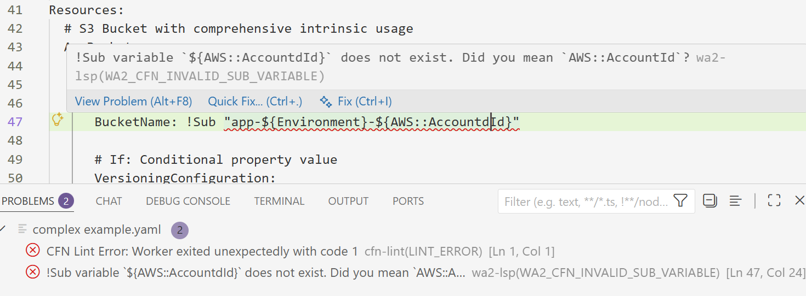

# WA2 VS Code Extension (Early Preview)

The **WA2 VS Code extension** provides **fast, workspace-aware validation** for CloudFormation templates inside VS Code. The vision is **an ultra-fast architecture guide inside your IDE** that validates not just syntax and semantics, but your **architectural intent**.

This is an **early open-source prototype** focused on building the foundation - a high-performance language server (LSP) written in Rust that can analyse CloudFormation YAML/JSON and deliver near-instant diagnostics, even on large workspaces.

## 🎯 The Three-Phase Journey

WA2 is being built in three phases:

1. **Syntax** ✅ (Current) - Parse CloudFormation, validate structure, check resource types and properties
2. **Semantics** (Next) - Understand cross-resource relationships, dependencies, and runtime behavior
3. **Intent** (Goal) - Validate against your architectural principles and Well-Architected best practices

This repository is being built over **45 days**, starting December 1, 2025.

## Preview



## ✨ Current Capabilities (Phase 1 - Day 16)

**CloudFormation Validation:**
- ✅ Full YAML and JSON parsing with accurate position tracking
- ✅ Resource type validation against AWS CloudFormation spec
- ✅ Required and unknown property detection
- ✅ Type checking with intelligent type resolution
- ✅ Parameters and Conditions section support

**Intrinsic Functions (12 fully validated):**
- Core: `!Ref`, `!GetAtt`, `!Sub`, `!Join`, `!Select`, `!GetAZs`
- Conditionals: `!If` with full Conditions support
- Logic: `!Equals`, `!Not`, `!And`, `!Or`, `!Condition`

**Error Recovery:**
- Levenshtein edit distance for "Did you mean..." suggestions
- LSP CodeActions (quick fixes) - click the lightbulb to fix typos instantly
- Works for GetAtt attributes, Ref targets, and property names

**Performance:**
- All validation completes in <100ms
- Rust-powered LSP for maximum speed
- Time-budgeted analysis ensures editor stays responsive

## 🚧 What's Working Right Now

Open a CloudFormation template and WA2 immediately:
- Catches unknown resource types
- Flags missing required properties (e.g., Lambda `Code` property)
- Validates intrinsic function references exist
- Checks property types match expectations
- Suggests corrections for typos
- Provides one-click fixes via CodeActions

All diagnostics appear as you type, with no deployment required.

## 🛠 How to Build

### 1. Build the LSP server

From the repository root:
```bash
git clone https://github.com/unremarkable-technology/wa2-vscode-extension
cd wa2-vscode-extension
cargo install --path server/wa2lsp
```

This installs the `wa2lsp` binary into your Cargo bin directory (typically `~/.cargo/bin`).

Verify:
```bash
wa2lsp --version
```

### 2. Run the extension
```bash
cd client/wa2
npm install
npm run compile    # or npm run watch for development
```

Then press **F5** in VS Code to launch the Extension Development Host.

## 📋 Supported File Types

Phase 1 focuses on CloudFormation templates:
- `.yaml`, `.yml`
- `.json`

## 🧩 Architecture
```
VS Code client (TypeScript)
      ⬇ LSP / stdio
Rust language server (tower-lsp)
      ⬇ parses (saphyr/jsonc-parser)
CloudFormation YAML/JSON
      ⬇ builds
Intermediate Representation (IR)
      ⬇ validates
AWS CloudFormation Spec + Symbol Table
      ⬇ produces
Diagnostics + CodeActions
```

The LSP is built with:
- **tower-lsp** - LSP protocol framework
- **saphyr** - YAML parsing with position tracking
- **jsonc-parser** - JSON parsing with comments

## 🎓 What's Next

**Phase 1 completion:**
- Hover information (documentation on hover)
- Go to definition
- Remaining intrinsic functions
- Circular dependency detection

**Phase 2 (Semantics):**
- Cross-resource relationship analysis
- Dependency graph validation
- Runtime behavior prediction

**Phase 3 (Intent):**
- Well-Architected Framework integration
- Custom architectural rules
- Team-specific best practices

## 📦 License

This project is released under the **Apache 2.0 License**. See [LICENSE](LICENSE) for details.

---

**Status:** Active development (Day 16 of 45) | Built with ❤️ in Rust